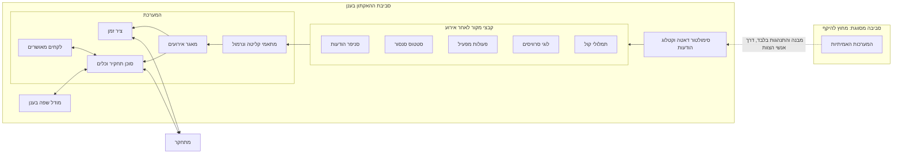

# ארכיטקטורת TRACE

מסמך ארכיטקטורה, גרסה ראשונה, 5 באוקטובר 2026.

מערכת לתחקיר רטרוספקטיבי של אירועים מבצעיים במכ״ם וב־IFF: ציר זמן מאוחד מכל המקורות, וסוכן שעונה על שאלות תחקיר עם ראיות מדויקות.

**תרחיש הדמו (בדוי):**

1. שנייה 0: מטרה משדרת קוד חטיפה 7500, וה־IFF קולט אותו.
2. שירות ההתרעות נופל, וההתרעה לא מגיעה למפעיל.
3. במשך 102 שניות אין תגובה של המפעיל.

---

## 1. הגדרת הבעיה וההיקף

מערכת TRACE הופכת תחקיר ידני של אירוע מבצעי לשני תוצרים: ציר זמן מאוחד שמספר מה קרה, וסוכן שעונה על שאלות תחקיר עם ראיות. היום התחקיר סיזיפי, יקר בזמן ובכוח אדם, ופרטים קריטיים מתפספסים.

### מה הדמו חייב להוכיח לבכירי הארגון

- ציר זמן אחד מכל המקורות, שממנו מבינים את האירוע גם בלי לשאול שאלה.
- סוכן שמגיע לשורש הכשל, מצליב בין מקורות, ומפנה לכל ראיה.
- מענה לשלושה סוגי שאלות: למה המערכת לא זיהתה, למה המפעיל לא הסיק נכון, ומאיזו נקודה התחיל הכשל.

### מסגרת

21 שעות, 5 אנשים, סביבת ענן עם מודלי שפה, ופיתוח אגנטי במקביל. הדמו הוא סרטון של כמה דקות שמצלם את המערכת החיה.

| בתוך ההאקתון | אחרי ההאקתון |
| --- | --- |
| דאטה מסומלץ בלבד: תרחיש אחד או שניים, עם רעש | מתאמים למקורות האמיתיים |
| קליטת קבצים לאחר אירוע (batch) | הרצה בסביבה סגורה עם מודל מקומי |
| חמישה סוגי מקורות, מתאם לכל אחד | מידור בין משתמשים ורישום פעולות |
| ציר זמן לפי טווח שעות, עם drill-down | דוח תחקיר כתוצר רשמי (הפורמט עוד לא ידוע) |
| סוכן עם מסקנה, ציון ביטחון ואישור מפעיל | שכבת למידה מלאה |
| שכבת לקחים דקה | תמלול קול בתוך המערכת |
| ממשק בעברית | |

חלון תחקיר: לכל היותר 14 עד 16 שעות, על פני יומיים. נפח: פחות ממיליוני רשומות לתחקיר.

---

## 2. תרשים הקשר

כל מה שנבנה בהאקתון יושב מחוץ לסביבה המסווגת. המידע היחיד שחוצה את הגבול הוא ידע על מבנה והתנהגות, שעובר דרך אנשי הצוות ולא דרך קבצים.

המתחקר הוא מפעיל, מהנדס מערכת או גורם תחקיר. בשלב הזה אין מידור: מי שהגיע לתחקיר מורשה לראות הכל.

---

## 3. רכיבים לוגיים

מודל האירוע האחיד הוא החוזה המרכזי. כל רכיב אחר תלוי רק בו, ולכן הוא נסגר בשעתיים הראשונות ומאפשר לחמישה מסלולים לעבוד במקביל.

| # | רכיב | אחריות |
| --- | --- | --- |
| 1 | סימולטור דאטה | מייצר קבצי מקור לתרחיש, כולל רעש, ולצדם קובץ ground truth |
| 2 | קטלוג הודעות | תיאור סוגי ההודעות והשדות. משמש את הסימולטור, את התצוגה ואת הסוכן |
| 3 | מתאמי קליטה | מתאם לכל מקור: קורא קובץ בפורמט המקור ומחזיר אירועים במודל האחיד |
| 4 | נרמול | פורמט זמן אחיד, מזהי הצלבה אחידים ומיון. אין תיקון שעונים |
| 5 | מאגר אירועים | מאגר מובנה אחד לתחקיר, עם סינון לפי זמן, מקור, סוג ומזהה, וחיפוש טקסט |
| 6 | שכבת כלים | הממשק היחיד של הסוכן לדאטה. ציר הזמן משתמש באותן שאילתות |
| 7 | סוכן תחקיר | מתכנן, שולף, מצליב ומסיק, ומצרף ראיות וציון ביטחון |
| 8 | תצוגת ציר זמן | טווח שעות נבחר, שכבה לכל מקור, וירידה לאירוע ולרשומת המקור |
| 9 | צ'אט ואישור | שאלה, תשובה עם ראיות לחיצות, ואישור או כוונון של המפעיל |
| 10 | שכבת לקחים | מסקנות מאושרות שנשמרות ונטענות לסוכן בתחקיר הבא |
| 11 | הערכה | מריץ שאלות קבועות מול ground truth ומודד נכונות ודיוק ציטוט |

**שינויים מול נקודת הפתיחה:** יישור זמנים אינו רכיב נפרד, כי השעונים מסונכרנים והוא נבלע בנרמול. נוספו קטלוג הודעות, שכבת כלים כרכיב עצמאי, ושכבת לקחים.

### מודל האירוע האחיד (שדות לוגיים)

- מזהה אירוע ייחודי. זה מה שהסוכן מצטט.
- מקור וסוג אירוע.
- זמן מערכת.
- זמן מיוחס ורמת ודאות. רלוונטי בעיקר לקול, שבו זמן ההקלטה אינו הזמן שעליו מדברים.
- מזהי הצלבה: מטרה, מפעיל או עמדה, הודעה וסרוויס. הרשימה המדויקת היא פרמטר.
- חומרה או רמה, כשהיא קיימת במקור.
- תוכן מובנה (שדות) וטקסט חופשי.
- הפניה לרשומת המקור המקורית, לצורך ירידה לפרטים והוכחה.
- סוג ראיה: קשה (נרשמה על ידי מערכת) או רכה (קול, פרשנות).

**הוספת מקור חדש** היא כתיבת מתאם אחד ורישום סוגי האירועים שלו בקטלוג. שום רכיב אחר לא משתנה.

---

## 4. פלואו עיקריים

ארבעת הפלואו שהוגדרו, ועוד אחד קצר שנוסף בעקבות שכבת הלקחים.

### 4.1 קליטה

1. המתחקר פותח תחקיר חדש ומעלה את קבצי המקורות של האירוע.
2. כל קובץ מנותב למתאם של המקור שלו.
3. המתאם מפרסר ומחזיר אירועים במודל האחיד, עם הפניה לרשומת המקור.
4. הנרמול מאחד פורמט זמן ומזהי הצלבה.
5. האירועים נכתבים למאגר התחקיר.
6. דוח קליטה: כמה אירועים מכל מקור, איזה טווח זמן כוסה, ואילו רשומות נכשלו בפרסור.

### 4.2 בניית ציר זמן מאוחד

1. המתחקר בוחר טווח שעות.
2. המערכת שולפת את האירועים בטווח ומציגה אותם בשכבות לפי מקור.
3. בטווח רחב האירועים מקובצים לפי חלונות זמן, ואירועים חריגים (שגיאות, שינויי מצב, פערים) מודגשים.
4. אירועי קול מוצגים לפי הזמן המיוחס ומסומנים כראיה רכה.
5. לחיצה על נקודה פותחת את האירוע, את רשומת המקור ואת האירועים שחולקים איתו מזהה.
6. לחיצה על ראיה בתשובת הסוכן מקפיצה את ציר הזמן לאותו אירוע.

### 4.3 משאלת תחקיר ועד תשובה עם ראיות

1. המתחקר שואל שאלה בצ'אט.
2. הסוכן מקבל את השאלה, מפת התמצאות של התחקיר ולקחים רלוונטיים מתחקירים קודמים.
3. הסוכן מנסח השערות ושולף ראיות דרך הכלים: סינון, חיפוש, מעקב אחרי מזהה ואיתור פערים.
4. הסוכן מצליב בין מה שהמערכת ידעה, מה שהוצג למפעיל, ומה שהמפעיל עשה ואמר.
5. הסוכן מנסח מסקנה. כל טענה מפנה למזהי אירועים.
6. בדיקה דטרמיניסטית: כל מזהה שצוטט קיים במאגר ותואם את הטענה. טענה בלי ראיה מוסרת או מסומנת כהשערה.
7. ציון ביטחון מחושב מהראיות ומוצג עם התשובה. הנימוק המלא נפתח בלחיצה.
8. המתחקר מאשר, או מכוונן והסוכן ממשיך מאותה נקודה.

### 4.4 יצירת דאטה מסומלץ לתרחיש

1. מגדירים תרחיש: רצף האירועים הסיבתי, נקודת הכשל והתוצאה. לדוגמה: קוד 7500 נקלט, שירות ההתרעות נופל, ואין תגובה 102 שניות.
2. מקטלוג ההודעות נגזרים סוגי ההודעות והשדות שכל מקור מייצר.
3. הסימולטור מייצר את אירועי התרחיש בכל חמשת המקורות, עם מזהים עקביים ביניהם.
4. מוסיפים רעש: פעילות תקינה לאורך שעות, מטרות נוספות ושגיאות לא קשורות.
5. נכתבים קבצי מקור בפורמט של כל מקור, כאילו נאספו לאחר אירוע.
6. נכתב קובץ ground truth: שורש הכשל, שרשרת האירועים, והמזהים שתשובה נכונה חייבת לצטט.

### 4.5 סגירה ולמידה (גרסה דקה)

1. המתחקר מאשר את המסקנות.
2. המסקנות המאושרות נשמרות כלקחים קצרים, בלי הדאטה הגולמי.
3. באישור המפעיל, הדאטה הגולמי של התחקיר נמחק.
4. בתחקיר הבא הלקחים נטענים לסוכן כהקשר.

---

## 5. שיטת השליפה ותכנון ה־harness

ההחלטה: סוכן עם כלים מעל מאגר אירועים מובנה. מאגר וקטורי אינו חלק מה־MVP. מה שנשאר פתוח הוא איך בונים את ה־harness בצורה הטובה ביותר, ולכך מוקדש החלק השני של הסעיף.

### 5.1 האפשרויות שנבחנו

| גישה | יתרונות | חסרונות |
| --- | --- | --- |
| א. מאגר וקטורי | טוב לטקסט חופשי: תמלולי קול והערות בלוגים | חלש בזמן, במזהים ובספירה. לא מוצא מה שלא קרה. ציטוט פחות מדויק |
| ב. מאגר אירועים מובנה | מדויק ודטרמיניסטי. ציטוט לפי מזהה אירוע | חלש בטקסט חופשי. דורש לדעת מה לשאול |
| ג. סוכן עם כלים מעל ב' | מצליב, עוקב אחרי מזהים, מזהה פערים ומסביר את דרכו | תלוי באיכות הכלים. איטי יותר לכל שאלה |

**ההמלצה: ג' על בסיס ב'.** שלושה נימוקים:

- התרחיש המרכזי הוא על היעדר: התרעה שלא הגיעה, 102 שניות בלי תגובה. דמיון סמנטי לא מוצא היעדר, שאילתה מובנית כן.
- רוב הדאטה מובנה, עם זמן אמין ומזהים משותפים. זה בדיוק מה שמאגר מובנה מנצל.
- הנפח קטן ממיליוני רשומות והדאטה זמני, כך שאין הצדקה לתשתית אינדוקס כבדה.

חיפוש סמנטי נשאר תוספת אופציונלית לתמלולי הקול בלבד, אם חיפוש טקסט רגיל לא יספיק.

### 5.2 כיוון מוצע ל־harness

העיקרון: הסוכן לא קורא דאטה גולמי בכמויות. הוא מקבל מפה, שואל שאלות ממוקדות, ומקבל תשובות קצרות עם מזהים.

**מפת התמצאות.** מעבר דטרמיניסטי אחד על התחקיר אחרי הקליטה, בלי מודל שפה: ספירת אירועים לפי מקור וחלון זמן, רשימת שגיאות ושינויי מצב, ופערים חשודים. הסוכן מתחיל כל שאלה מהמפה הזו ולא מחיפוש עיוור.

**סט כלים קטן:**

| כלי | מה הוא מחזיר |
| --- | --- |
| סינון אירועים | אירועים לפי טווח זמן, מקור, סוג ומזהה. מוגבל בכמות, עם ספירה כוללת |
| ספירה וקיבוץ | כמה אירועים מכל סוג בכל חלון זמן |
| חיפוש טקסט | אירועים שהטקסט שלהם מכיל ביטוי. בעיקר לקול וללוגים |
| סביבת אירוע | מה קרה בכל המקורות בשניות שלפני ואחרי אירוע נתון |
| מעקב מזהה | כל האירועים בכל המקורות שחולקים מזהה, לפי סדר זמן |
| איתור פערים | היכן אירוע צפוי לא הופיע, או היכן מקור השתתק |
| תיאור סוג הודעה | הסבר מהקטלוג על סוג הודעה ועל השדות שלו |
| קריאת אירוע מלא | רשומה אחת במלואה, כולל רשומת המקור |

**ראיות וציון ביטחון:**

- הסוכן רשאי לצטט רק מזהי אירועים שחזרו אליו מכלי. בדיקה דטרמיניסטית אוכפת את זה לפני שהתשובה מוצגת.
- ציון הביטחון מחושב מהראיות: כמה מקורות בלתי תלויים תומכים, ראיות קשות מול רכות, והאם יש ראיות סותרות. הוא אינו מספר שהמודל מצהיר על עצמו.
- כשאין מספיק ראיות, התשובה היא השערה מסומנת, עם ציון נמוך ורשימה של מה שחסר.

**מבנה הסוכן ל־MVP:** סוכן אחד עם לולאה של תכנון, שליפה והסקה. פיצול לתת־סוכנים לפי מקור נדחה, כי הוא מוסיף תיאום ולא נדרש בנפח הזה.

### 5.3 מה עדיין פתוח ב־harness

- **גרעיניות הכלים:** מעט כלים כלליים, או יותר כלים ייעודיים לדומיין (למשל "שרשרת התרעה למטרה"). הצעה: להתחיל כללי, ולהוסיף כלי ייעודי רק כשההערכה מראה שהסוכן נכשל.
- **כמה עבודה עושה המעבר הדטרמיניסטי:** רק ספירות ופערים, או גם סימון חריגות לפי חוקים. יותר חוקים מקצרים את הדרך לסוכן, אבל מקבעים הנחות על הדומיין.
- **איתור פערים:** מה נחשב אירוע צפוי. זה דורש כללי ציפייה, למשל: אחרי הודעה מסוג מסוים מצפים להודעת המשך בתוך מספר שניות מוגדר. הכללים האלה הם פרמטר שימולא עם ידע דומיין.
- **ניהול הקשר בחלון של 16 שעות:** האם הסוכן שומר סיכום ביניים של הממצאים, ואיך.
- **שיטת העבודה:** ה־harness מכוונן באיטרציות מול ground truth. לכן רכיב ההערכה צריך לעבוד מוקדם, לא בסוף.

---

## 6. מה נחשף למי

מודל הפיתוח ומודל הדמו בענן רואים רק מידע מסומלץ ומבנים מופשטים. העמודה השלישית היא הנחה לעתיד, ואינה חלק מההאקתון.

| מידע | מודל פיתוח ודמו (ענן) | מודל מקומי בפנים (עתידי) |
| --- | --- | --- |
| ארכיטקטורה, מודל אירוע וחוזי הכלים | כן | כן |
| דאטה מסומלץ וקטלוג הודעות מסומלץ | כן | לא רלוונטי |
| תרחיש הדמו הבדוי (קוד 7500) | כן | לא רלוונטי |
| הגדרות ממשק אמיתיות וסוגי הודעות אמיתיים | לא | כן |
| דאטה מבצעי אמיתי | לא | כן |
| שמות ומזהים אמיתיים של רכיבים, עמדות ומפעילים | לא. מוחלפים בשמות גנריים | כן |
| כללי ציפייה וספים אמיתיים | לא. פרמטר עם ערכים בדויים | כן |
| תמלולי קול אמיתיים | לא | כן |
| לקחים מתחקירים | רק מתחקירים מסומלצים | מתחקירים אמיתיים |

**כלל עבודה בהאקתון:** כל פרט שאי אפשר לחשוף נכנס כפרמטר או כמתאם עם ערך בדוי, ומסומן בסעיף ההנחות. אף אחד לא מדביק למודל פרט אמיתי כדי לשפר את הריאליזם.

---

## 7. הנחות, סיכונים, שאלות פתוחות והחלטות

### הנחות

- כל המקורות נאספים כקבצים לאחר האירוע. אין זרם חי.
- השעונים מסונכרנים בין ארבעת המקורות המובנים. לא נדרש תיקון סחיפה.
- קיימים מזהים משותפים בין מקורות. אילו מזהים קיימים באילו מקורות הוא פרמטר.
- תמלול הקול מגיע מוכן כטקסט. המערכת לא מתמללת ב־MVP.
- זמן הקלטת הקול אינו בהכרח הזמן שעליו מדברים. הזמן המיוחס נגזר מתוכן התמלול כשאפשר.
- מבנה הדאטה המסומלץ (מאות סוגי הודעות) בדוי, ונבנה לפי היכרות כללית של הצוות.
- התוצר הרשמי של תחקיר עוד לא ידוע, ולכן דוח הוא שכבה מעל הראיות ולא חלק מהליבה.
- מי שמגיע לתחקיר מורשה. אין מידור ואין רישום פעולות ב־PoC.

### סיכונים

| סיכון | השפעה | מענה |
| --- | --- | --- |
| הדאטה המסומלץ פשוט מדי, והסוכן מוצא את הכשל בלי מאמץ | הדמו לא משכנע | רעש ריאליסטי, שגיאות לא קשורות, ושאלות שדורשות הצלבה של שלושה מקורות לפחות |
| חמישה מסלולים מקבילים מתבדרים | האינטגרציה נכשלת בסוף | חוזים בשעתיים הראשונות, וקובץ אירועים לדוגמה שכולם עובדים מולו |
| ה־harness דורש יותר כוונון מהצפוי | תשובות לא יציבות בהקלטה | הערכה מול ground truth מהשעה ה־12, ושאלות דמו קבועות מראש |
| ציר זמן של 16 שעות עמוס מדי | הערך הראשון לא נראה | קיבוץ לפי חלונות והדגשת חריגות כברירת מחדל |
| ייחוס זמן שגוי לקול | ראיה במקום הלא נכון | סימון כראיה רכה והצגת רמת הוודאות |
| חשיפת פרט מסווג בזמן הפיתוח | אירוע ביטחוני | כלל העבודה מסעיף 6, ובדיקת התרחיש לפני הצגה |

### שאלות פתוחות

- מה התוצר הרשמי של תחקיר היום: דוח, מצגת, קביעת שורש כשל?
- מה סדר הגודל המדויק של אירועים בתחקיר?
- האם התרחיש הבדוי מאושר להצגה, ומה אסור להראות בדמו?
- מי מאשר שהדאטה המסומלץ דומה מספיק למציאות?
- כמה סוגי הודעות הקטלוג המסומלץ צריך לכלול כדי להיות אמין?
- השאלות הפתוחות של ה־harness מסעיף 5.3.

### החלטות שצריך לקבל

- [ ] תרחיש אחד עמוק, או שניים, כשהשני מדגים שימוש בלקח מהראשון
- [ ] האם התרחיש השני הוא טעות מפעיל, כדי לכסות גם את השאלה "למה המפעיל לא הסיק נכון"
- [ ] פריסת המסך: ציר זמן וצ'אט זה לצד זה, או זה מעל זה
- [ ] סוכן אחד, או פיצול לתת־סוכנים לפי מקור
- [ ] אישור המבנה, ואז בחירת טכנולוגיות
- [ ] חלוקת חמשת המסלולים בין אנשי הצוות

---

## 8. חלוקה לשלבים

ה־MVP נבנה בחמישה מסלולים מקבילים שנפגשים בשעה 12. מה שמאפשר את המקביליות הוא שלושה חוזים שנסגרים בשעתיים הראשונות.

### לוח זמנים (שעות מתחילת ההאקתון)

| שלב | שעות | מה קורה |
| --- | --- | --- |
| חוזים | 0 עד 2 | כל הצוות סוגר את החוזים וקובץ הדוגמה |
| בנייה במקביל | 2 עד 12 | חמישה מסלולים עובדים מול קובץ הדוגמה |
| אינטגרציה | 12 עד 15 | חיבור מקצה לקצה על דאטה מהסימולטור |
| כוונון וליטוש | 15 עד 19 | כוונון ה־harness מול ground truth, ליטוש ציר הזמן, ותרחיש שני אם נשאר זמן |
| הקלטת הסרטון | 19 עד 21 | הקלטה עם שאלות דמו קבועות מראש |

### החוזים (שעות 0 עד 2, כל הצוות)

1. מודל האירוע האחיד, כולל קובץ אירועים לדוגמה שנכתב ביד.
2. חוזה שכבת הכלים: שמות הכלים, קלט ופלט.
3. הגדרת התרחיש ומבנה קובץ ה־ground truth.

### מסלולים מקבילים (שעות 2 עד 12)

| מסלול | תוצר | עובד מול |
| --- | --- | --- |
| א. סימולטור | קטלוג הודעות, מחולל תרחיש עם רעש, קבצי מקור ו־ground truth | הגדרת התרחיש |
| ב. קליטה ומאגר | חמישה מתאמים, נרמול, מאגר אירועים ודוח קליטה | מודל האירוע. קובץ הדוגמה עד שהסימולטור מוכן |
| ג. כלים וסוכן | שכבת הכלים, מפת התמצאות, לולאת הסוכן, בדיקת ציטוט וציון ביטחון | חוזה הכלים וקובץ הדוגמה |
| ד. ציר זמן | תצוגה לפי טווח שעות, שכבות, קיבוץ וירידה לפרטים | מודל האירוע וקובץ הדוגמה |
| ה. צ'אט, לקחים והערכה | צ'אט עם ראיות לחיצות, אישור וכוונון, שמירת לקחים ומריץ הערכה | חוזה הכלים ומבנה ה־ground truth |

### סדר ויתור אם הזמן נגמר

1. תרחיש שני.
2. שכבת הלקחים.
3. חיפוש סמנטי בקול.
4. כוונון של המפעיל באמצע תשובה.

ציר הזמן, הסוכן עם ראיות ותרחיש אחד עם רעש אינם ניתנים לוויתור.

### אחרי ההאקתון

- מתאמים אמיתיים, כללי ציפייה אמיתיים וקטלוג הודעות אמיתי, בתוך הסביבה המסווגת.
- החלפת מודל הענן במודל מקומי, ובדיקה שה־harness מחזיק עם מודל חלש יותר.
- הגדרת התוצר הרשמי של תחקיר והפקת דוח.
- שכבת למידה מלאה, רישום פעולות ומידור.

